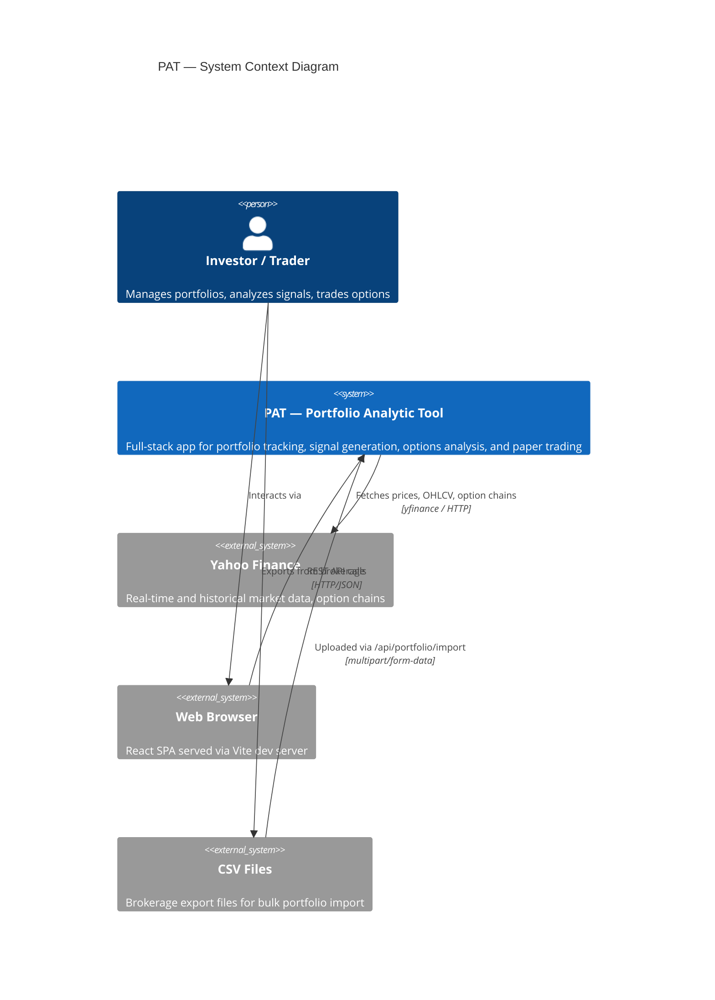

# Architecture

## Context Diagram

Shows PAT's boundaries and external interactions.



```
                         ┌──────────────┐
                         │   Investor   │
                         │   / Trader   │
                         └──────┬───────┘
                                │ Interacts via browser
                                ▼
                     ┌─────────────────────┐
                     │    Web Browser       │
                     │  (React SPA :5173)   │
                     └──────────┬──────────┘
                                │ REST API (HTTP/JSON)
                                ▼
    ┌───────────┐    ┌─────────────────────┐    ┌──────────────────┐
    │ CSV Files │───▶│        PAT          │───▶│  Yahoo Finance   │
    │ (brokerage│    │   Backend :8000     │    │  (market data)   │
    │  exports) │    │                     │    │                  │
    └───────────┘    └──────────┬──────────┘    └──────────────────┘
                                │
                                ▼
                     ┌─────────────────────┐
                     │   SQLite Database   │
                     │     (pat.db)        │
                     └─────────────────────┘
```

## Architecture Diagram

Detailed view of internal structure, modules, and data flow.

```mermaid
graph TB
    subgraph Frontend ["Frontend (React + TypeScript + Recharts)"]
        direction TB
        APP[App.tsx — Router & Nav]
        APP --> DASH[Dashboard<br/>Summary cards, P&L table,<br/>Allocation pie chart]
        APP --> ANAL[Analytics<br/>Price charts, Volume bars,<br/>Risk metric cards]
        APP --> SIG[Signals<br/>Composite score, Risk context,<br/>Signal breakdown chart]
        APP --> OPT[Options & LEAPS<br/>IV metrics, Skew chart,<br/>Term structure, LEAPS table]
        APP --> OPTIM[Optimize<br/>Efficient frontier scatter,<br/>Allocation cards]
        APP --> ALERT[Alerts<br/>Create/delete/check alerts]
        APP --> PAPER[Paper Trading<br/>Account summary,<br/>Open/close trades]
        APP --> IMP[Import<br/>CSV upload]
        AXIOS[Axios API Client<br/>baseURL: /api]
    end

    subgraph Backend ["Backend (FastAPI + SQLAlchemy Async)"]
        direction TB

        subgraph Routers ["API Routers"]
            R_PORT["/api/portfolio<br/>Asset & Position CRUD<br/>Transaction tracking"]
            R_ANAL["/api/analyze<br/>Summary, Performance,<br/>Optimize"]
            R_SIG["/api/signals<br/>Composite scan"]
            R_OPT["/api/options<br/>Overview, LEAPS"]
            R_ALERT["/api/alerts<br/>CRUD + Check"]
            R_PAPER["/api/paper<br/>Summary, Trades"]
            R_IMP["/api/portfolio/import<br/>CSV import"]
        end

        subgraph Modules ["Core Modules"]
            direction TB

            subgraph Analyzer ["Analyzer"]
                METRICS[metrics.py<br/>Sharpe, CAGR,<br/>Max Drawdown]
                GREEKS[greeks.py<br/>Black-Scholes,<br/>Delta/Gamma/Theta/Vega/Rho,<br/>IV solver]
                OPT_ANAL[options.py<br/>IV rank/percentile,<br/>Skew, Term structure]
                LEAPS[leaps.py<br/>Theta efficiency,<br/>Roll timing]
                OPTIMIZER[optimizer.py<br/>Efficient frontier,<br/>Risk parity]
            end

            subgraph Signals ["Signal Engine"]
                TECH[technical.py<br/>SMA, EMA, RSI, MACD,<br/>Bollinger, ATR, OBV]
                SCORE[scoring.py<br/>7 evaluators<br/>each → [-1, +1]]
                COMP[composite.py<br/>Weighted composite<br/>Direction/Conviction/Confidence]
                RISK[risk.py<br/>ATR stop-loss,<br/>Kelly criterion,<br/>Position sizing]
            end

            subgraph Tracker ["Tracker"]
                MDATA[market_data.py<br/>get_current_price<br/>get_history<br/>get_option_chain]
                CSV[csv_import.py<br/>Column aliases,<br/>Date parsing,<br/>Validation]
            end
        end

        subgraph DataLayer ["Data Layer"]
            DB[(SQLite<br/>pat.db)]
            MODELS[Models<br/>Asset, Position, Transaction<br/>Alert<br/>PaperTrade, PaperAccount]
        end
    end

    subgraph External ["External"]
        YAHOO[Yahoo Finance<br/>via yfinance]
    end

    %% Frontend to Backend
    AXIOS -->|HTTP/JSON| Routers

    %% Router to Module connections
    R_PORT --> MODELS
    R_ANAL --> METRICS
    R_ANAL --> MDATA
    R_ANAL --> OPTIMIZER
    R_SIG --> TECH
    R_SIG --> SCORE
    R_SIG --> COMP
    R_SIG --> RISK
    R_SIG --> MDATA
    R_OPT --> GREEKS
    R_OPT --> OPT_ANAL
    R_OPT --> LEAPS
    R_OPT --> MDATA
    R_ALERT --> MODELS
    R_ALERT --> MDATA
    R_PAPER --> MODELS
    R_IMP --> CSV
    R_IMP --> MODELS

    %% Signal chain
    TECH --> SCORE
    SCORE --> COMP

    %% Data layer
    MODELS --> DB

    %% External
    MDATA -->|asyncio.to_thread| YAHOO
```

```
┌─────────────────────────────────────────────────────────────────────────────┐
│                     FRONTEND  (React + TypeScript + Recharts)               │
│                                                                             │
│  ┌───────────┐ ┌──────────┐ ┌─────────┐ ┌─────────┐ ┌──────────┐          │
│  │ Dashboard  │ │Analytics │ │ Signals │ │ Options │ │ Optimize │          │
│  │ Summary    │ │ Price    │ │ Scanner │ │ IV/Skew │ │ Frontier │          │
│  │ P&L Table  │ │ Volume   │ │ Risk    │ │ LEAPS   │ │ Weights  │          │
│  │ Alloc Pie  │ │ Metrics  │ │ Scores  │ │ Greeks  │ │ Cards    │          │
│  └───────────┘ └──────────┘ └─────────┘ └─────────┘ └──────────┘          │
│  ┌──────────┐ ┌──────────────┐ ┌───────────┐                               │
│  │  Alerts  │ │ Paper Trading│ │  Import   │     Axios API Client           │
│  │ CRUD     │ │ Open/Close   │ │ CSV Upload│     baseURL: localhost:8000/api│
│  │ Check    │ │ P&L History  │ │ Results   │                               │
│  └──────────┘ └──────────────┘ └───────────┘                               │
└───────────────────────────────┬─────────────────────────────────────────────┘
                                │  HTTP / JSON
                                ▼
┌─────────────────────────────────────────────────────────────────────────────┐
│                     BACKEND  (FastAPI + SQLAlchemy Async)                   │
│                                                                             │
│  ┌─── API Routers ────────────────────────────────────────────────────────┐ │
│  │ /api/portfolio      Assets, Positions, Transactions CRUD               │ │
│  │ /api/portfolio/import   CSV file upload                                │ │
│  │ /api/analyze        Summary, Performance, Optimize                     │ │
│  │ /api/signals        Composite signal scan                              │ │
│  │ /api/options        IV overview, LEAPS analysis                        │ │
│  │ /api/alerts         Alert CRUD + bulk check                            │ │
│  │ /api/paper          Paper trade open/close/summary                     │ │
│  │ /api/health         System health check                                │ │
│  └────────────────────────────────────────────────────────────────────────┘ │
│                                                                             │
│  ┌─── Analyzer ──────────┐  ┌─── Signal Engine ──────┐  ┌─── Tracker ───┐ │
│  │ metrics.py            │  │ technical.py            │  │ market_data.py│ │
│  │  Sharpe, CAGR,        │  │  SMA, EMA, RSI, MACD,  │  │  Prices,      │ │
│  │  Max Drawdown, Vol    │  │  Bollinger, ATR, OBV    │  │  OHLCV,       │ │
│  │                       │  │          │              │  │  Option chains│ │
│  │ greeks.py             │  │          ▼              │  │               │ │
│  │  Black-Scholes,       │  │ scoring.py              │  │ csv_import.py │ │
│  │  Delta/Gamma/Theta/   │  │  7 evaluators [-1,+1]   │  │  Parse, alias,│ │
│  │  Vega/Rho, IV solver  │  │          │              │  │  validate     │ │
│  │                       │  │          ▼              │  └───────┬───────┘ │
│  │ options.py            │  │ composite.py            │          │         │
│  │  IV rank/percentile,  │  │  Weighted aggregate     │          │         │
│  │  Skew, Term structure │  │  Direction/Conviction   │   asyncio.to_thread│
│  │                       │  │          │              │          │         │
│  │ leaps.py              │  │          ▼              │          ▼         │
│  │  Theta efficiency,    │  │ risk.py                 │  ┌──────────────┐ │
│  │  Roll timing          │  │  ATR stop, Kelly,       │  │Yahoo Finance │ │
│  │                       │  │  Position sizing,       │  │ (yfinance)   │ │
│  │ optimizer.py          │  │  Risk/reward            │  └──────────────┘ │
│  │  Monte Carlo frontier,│  └────────────────────────┘                    │
│  │  Risk parity          │                                                │
│  └───────────────────────┘                                                │
│                                                                             │
│  ┌─── Data Layer ────────────────────────────────────────────────────────┐ │
│  │  SQLAlchemy ORM (async + aiosqlite)                                   │ │
│  │                                                                       │ │
│  │  ┌─────────┐    ┌──────────┐    ┌─────────────┐                      │ │
│  │  │  Asset   │───▶│ Position │───▶│ Transaction │                      │ │
│  │  │ symbol   │ 1:N│ quantity │ 1:N│ type        │                      │ │
│  │  │ type     │    │ avg_cost │    │ quantity    │                      │ │
│  │  │ strike   │    └──────────┘    │ price       │                      │ │
│  │  │ expiry   │                    └─────────────┘                      │ │
│  │  └─────────┘                                                          │ │
│  │  ┌─────────┐    ┌──────────────┐    ┌──────────────┐                  │ │
│  │  │  Alert  │    │  PaperTrade  │    │ PaperAccount │                  │ │
│  │  │ symbol  │    │ symbol       │    │ initial_cash │                  │ │
│  │  │ type    │    │ direction    │    │ current_cash │                  │ │
│  │  │threshold│    │ entry/exit   │    └──────────────┘                  │ │
│  │  │triggered│    │ pnl/pnl_pct  │                                      │ │
│  │  └─────────┘    └──────────────┘             ┌─────────────────────┐  │ │
│  │                                               │   SQLite (pat.db)  │  │ │
│  │                                               └─────────────────────┘  │ │
│  └───────────────────────────────────────────────────────────────────────┘ │
└─────────────────────────────────────────────────────────────────────────────┘
```

## Data Flow

### 1. Portfolio Tracking
```
User adds asset → POST /api/portfolio/assets
User opens position → POST /api/portfolio/positions (creates initial BUY txn)
User buys/sells → POST /api/portfolio/positions/{id}/transactions
  └─ BUY: recalculates weighted avg_cost
  └─ SELL: validates quantity, reduces position
Dashboard loads → GET /api/analyze/summary
  └─ Fetches all open positions from DB
  └─ Calls Yahoo Finance for live prices (concurrent)
  └─ Computes market value, P&L, allocation weights
```

### 2. Signal Generation
```
User enters symbol → GET /api/signals/scan?symbols=AAPL
  └─ Fetch 1yr OHLCV from Yahoo Finance
  └─ Compute 7 technical indicators (SMA, RSI, MACD, Bollinger, etc.)
  └─ Score each indicator → [-1, +1]
  └─ Weighted composite → direction + conviction + confidence
  └─ Compute risk context (ATR stop, Kelly sizing, risk/reward)
  └─ Return full signal report to frontend
```

### 3. Options Analysis
```
User enters symbol → GET /api/options/overview?symbol=SPY
  └─ Fetch option chains from Yahoo Finance
  └─ Compute IV rank/percentile from 1yr IV history
  └─ Compute put/call skew ratios (nearest expiry)
  └─ Compute ATM IV term structure (all expiries)
  └─ Return IV metrics, skew data, term structure

User clicks LEAPS tab → GET /api/options/leaps?symbol=SPY
  └─ Filter expirations > 365 DTE
  └─ For each LEAPS chain: compute Greeks via Black-Scholes
  └─ Filter by delta (|delta| > 0.5)
  └─ Compute theta efficiency, intrinsic/extrinsic split
  └─ Determine roll recommendation (hold / monitor / roll_now)
```

### 4. Portfolio Optimization
```
User enters symbols → GET /api/analyze/optimize?symbols=AAPL,MSFT,GOOGL
  └─ Fetch 1yr daily returns for each symbol
  └─ Generate 5000 random portfolio weights (Monte Carlo)
  └─ Compute annualized return + volatility for each
  └─ Identify max Sharpe ratio portfolio
  └─ Identify min variance portfolio
  └─ Compute risk parity weights (inverse-volatility)
  └─ Build efficient frontier curve (upper envelope)
  └─ Return all portfolios + frontier points
```

## Technology Stack

| Layer | Technology | Purpose |
|-------|-----------|---------|
| Frontend | React 18, TypeScript, Vite | SPA framework |
| Charts | Recharts | Pie, Area, Bar, Scatter, Line charts |
| Routing | React Router | Client-side navigation |
| HTTP Client | Axios | API communication |
| Backend | FastAPI, Python 3.14 | Async REST API |
| ORM | SQLAlchemy 2.0 (async) | Database access |
| Database | SQLite + aiosqlite | Persistent storage |
| Market Data | yfinance | Prices, OHLCV, option chains |
| Math | NumPy, pandas, scipy | Statistics, optimization, Black-Scholes |
| Testing | pytest (backend), Playwright (e2e) | 98 unit + 13 e2e tests |
